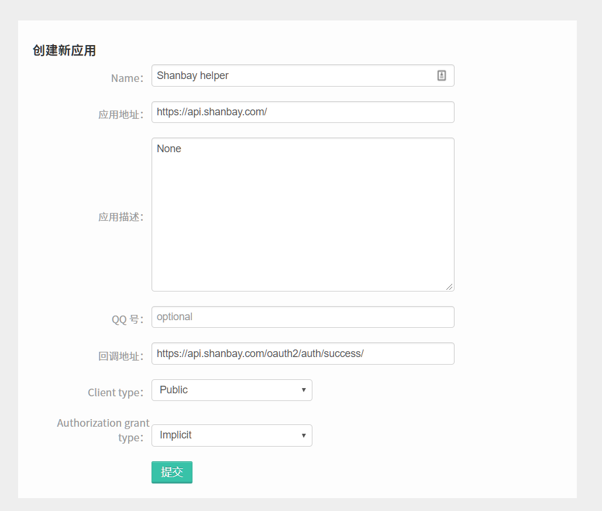

# Shanbay Helper

A chrome extension for [Shanbay](https://www.shanbay.com/).

## feature
* Search word.
* Save word to wordlist.

## how to use
1. Download it at release page.
2. Install it.
3. Create an oauth app on your shanbay account, at [here](https://www.shanbay.com/developer/application/mine), see [here](https://www.shanbay.com/help/developer/authorization/) for detail. like:

4. Select a word, then press alt key.
5. Chrome will show a confirm dialog, enter 'ok' to add this word to word list, cancel to cancel.

Have fun!
